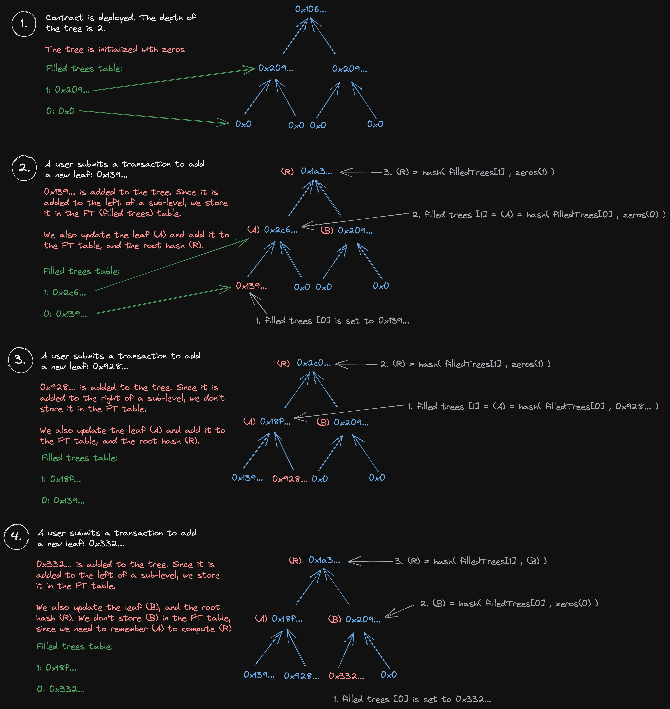

# Poseidon-incremental-merkle-tree

This repository contains a smart contract which implements an incremental merkle tree based on poseidon hash.

## Algorithm

THe contract uses a table, called filledTrees which stores all the latest left values of each level. Here is how it works
with a simple example:



## Usage

### Installation

```shell
npm i
```

### Compile contracts

This command compiles IncrementalMerkleTree.sol as well as the contract that implements the poseidon hash function which is
built using [circomlibjs](https://www.npmjs.com/package/circomlibjs).

```shell
npm run compile
```

### Test

Run all tests:

```shell
npm run test
```

Run unit tests:

```shell
npm run test:unit
```

Run integration tests:

```shell
npm run test:integration
```

### Deploy

Create a `.env` file with your infura API KEY as well as the private key of an account that has some ETH on
[rinkeby](https://rinkeby.etherscan.io/).
You'll also need to provide the number of level of your merkle tree (the maximum number of values in the merkle tree will be
2^NUMBER_OF_LEVEL), as well as the number of historical root that the contract will store simultaneously.

```shell
INFURA_API_KEY='...'
PRIVATE_KEY='...'
NUMBER_OF_LEVEL=2
NUMBER_OF_HISTORICAL_ROOTS=3
```

Then, run the deployment script:

```shell
npm run deploy
```

The contracts addresses will be printed in the console. Then, you can interact with the deployed contract using the script
`scripts/interactWithDeployedContract.js`. You'll need to replace `CONTRACT_ADDRESS` with the address of your freshly deployed
merkle tree contract.

## Areas of improvement

The solidity function `isKnownRoot` can do up to 2^32 iterations while looking for the root, which isn't great.
